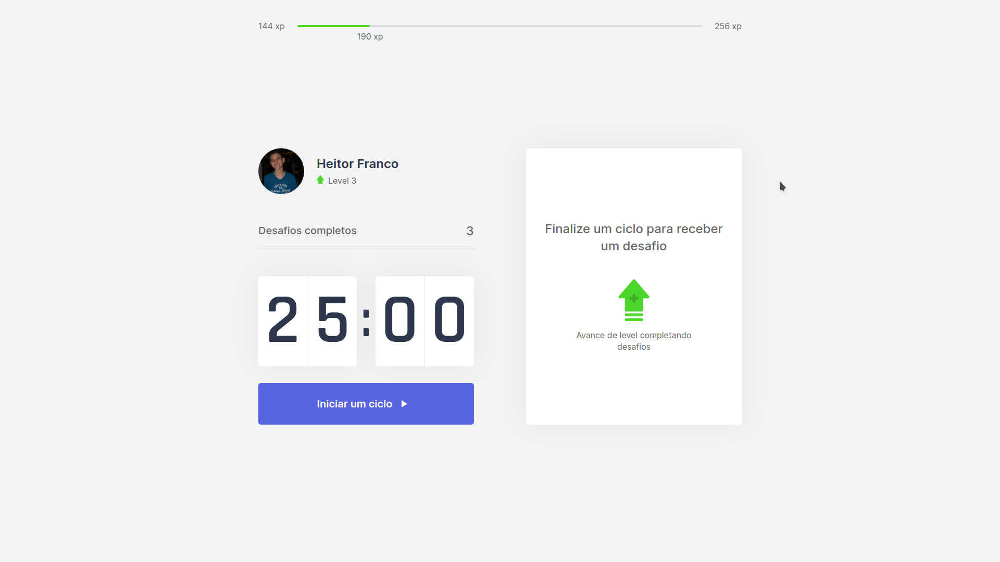

<h1 align="center">

</h1>

<p align="center">

</p>

## 🛠 Tecnologias

Esse projeto foi desenvolvido com as seguintes tecnologias:

- [React](https://reactjs.org)
- [Next.js](https://nextjs.org/)
- [TypeScript](https://www.typescriptlang.org/)

## 💻 Projeto

O move.it é um app que une a técnica de Pomodoro com a realização de exercícios físicos para quem passa muito tempo na frente do computador.

## 🚀 Como executar

## Clone o Repositório

```
$ git clone https://github.com/HeitorFranco/moveit.git

$ cd moveit
```

## Instalando Dependências

```
$ yarn
```

_or_

```
$ npm install
```

## Executando Aplicação

```
$ yarn dev
```

_or_

```
$ npm dev
```

Agora você pode acessar [`localhost:3000`](http://localhost:3000) do seu navegador.

## 📄 Licença

Esse projeto está sob a licença MIT. Veja o arquivo [LICENSE](LICENSE.md) para mais detalhes.

---

Feito com ❤️ by Heitor Franco
